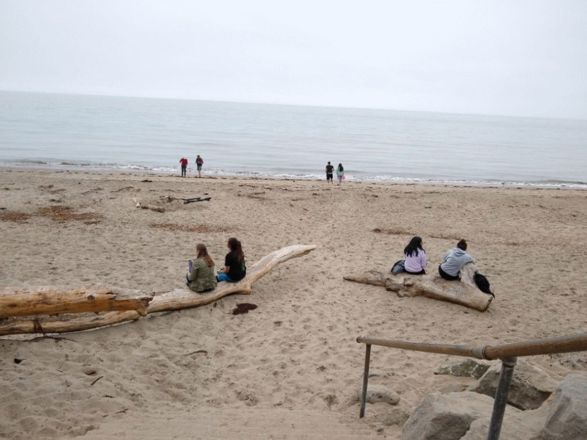

# Onwards and Upwards: To the Past!

## Blog Post (7/13/18), 9:20 A.M.

  This internship has been a gift that keeps on giving! On July 3rd, we went to New Brighton Beach!

### Thankfully, the beach was overcast, so it didn't get overly hot!:

### We saw lots of ***very cool*** fossils from ancient mollusks and whales which lived about 5 million years ago in the Pliocene!:

### Here's a picture of an amazingly preserved bed of mollusks!:

### Here's a more recent specimen: A beautifully polished shell of a crab!:

Luckily, the fun wasn't over! After the beach we went to the *Seymour Marine Discovery Center* to see the ***awesome*** view!:
]
Additionally, we got to see the bones of the largest animal by weight that ever lived on Earth: The Mighty Blue Whale!:

Don't forget it's relative: the Grey Whale!:

After that, we were on our way home. It was an awesome day full of exploration and great fossil finds! Thank you Ms. Saltzman and Mr. Heim for making this amazing field trip possible!

Thanks for all the support, and I look forward to the weeks ahead!

And as always:

**"*Life, uh, finds a way*"** ~ Jeff Goldblum

~ *Christopher Noll*
